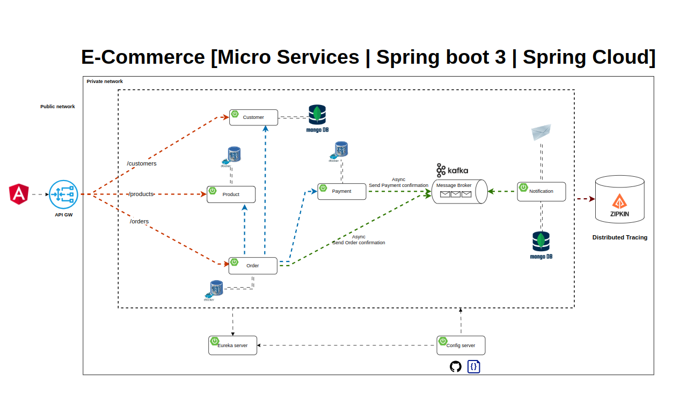

# E-Commerce Microservices Application

This project is an example of an e-commerce platform built using the microservices architecture. It includes services
for managing Customers, Products, Orders, Payments, Notifications, Configuration Server, Discovery Service, API Gateway.
The microservices are implemented using Spring Boot and integrate with various tools and services
like Config Server, Eureka Server, API Gateway, Zipkin, Kafka, MongoDB and PostgreSQL.

## Table of Contents

- [Architecture Overview](#architecture-overview)
- [Project Diagram](#project-diagram)
- [Services](#services)
    - [Config Service](#config-service)
    - [Discovery Service](#discovery-service)
    - [Gateway Service](#gateway-service)
    - [Customer Service](#customer-service)
    - [Product Service](#product-service)
    - [Order Service](#order-service)
    - [Payment Service](#payment-service)
    - [Notification Service](#notification-service)
- [Prerequisites](#prerequisites)
- [Running the Application](#running-the-application)
- [Distributed Tracing](#distributed-tracing)
- [Event-Driven Architecture](#event-driven-architecture)
- [Configuration](#configuration)
- [Security with Keycloak](#security-with-keycloak)
- [Acknowledgments](#acknowledgments)

## Architecture Overview

The application is composed of several microservices, many of them responsible for a specific domain:

- **Customer Service:** Manages customer data.
- **Product Service:** Manages product information.
- **Order Service:** Handles orders placed by customers.
- **Payment Service:** Manages payment processing.
- **Notification Service:** Sends notifications to customers.
- **Config Service:** Centralized configuration management for all services.
- **Discovery Service:** Service registry for service discovery.
- **Gateway Service:** Gateway for routing requests to appropriate microservices.

### Key Components:

- **Spring Cloud Config Server:** Centralized configuration management for all services.
- **Eureka Server:** Service registry for service discovery.
- **API Gateway:** Gateway for routing requests to appropriate microservices.
- **Zipkin:** Distributed tracing for monitoring request flow across services.
- **Kafka:** Message broker for event-driven communication between services.
- **Keycloak:** Identity and access management for securing the microservices.
- **MongoDB:** NoSQL database used for specific microservices (Customer Service, Notification Service).
- **PostgreSQL:** Relational database used for specific microservices (Product Service, Order Service, Payment Service).

### Project Diagram


## Services

### Config Service

- **Port:** `8888`
- **Description:** Handles centralized configuration management of services.

### Discovery Service

- **Port:** `8761`
- **Description:** Handles service registry of services.

### Gateway Service

- **Port:** `8222`
- **Description:** Handles routing requests to appropriate services.

### Customer Service

- **Port:** `8090`
- **Description:** Handles all operations related to customer management.

### Product Service

- **Port:** `8050`
- **Description:** Manages the catalog of products including adding, updating, and retrieving product details.

### Order Service

- **Port:** `8070`
- **Description:** Handles order processing, including order creation, status updates, and order history.

### Payment Service

- **Port:** `8060`
- **Description:** Processes payments for orders, including integration with payment service and customer service.

### Notification Service

- **Port:** `8040`
- **Description:** Sends notifications (order confirmation, payment confirmation) to customers via email.

## Prerequisites

- **Java 17** or later
- **Maven 3.8** or later
- **Kafka** (for message brokering)
- **MongoDB** (for Customer Service data persistence)
- **PostgreSQL** (for Product, Order, and Payment Services data persistence)
- **Keycloak** (for authentication and authorization)
- **Zipkin** (for distributed tracing)

## Running the Application

### Step 1: Clone the Repository

```bash
git clone https://github.com/Parnia-Varzdar/e-commerce-app.git
cd e-commerce-app/services
```

### Step 2: Start MongoDB, PostgreSQL, Maildev, Kafka, Zipkin, Keycloak

Start MongoDB and PostgreSQL using Docker Compose
```bash
docker-compose up -d mongo postgres
```

### Step 3: Start the Microservices

```bash

cd config-server
mvn spring-boot:run

cd discovery
mvn spring-boot:run

cd gateway
mvn spring-boot:run

cd customer
mvn spring-boot:run

cd product
mvn spring-boot:run

cd order
mvn spring-boot:run

cd payment
mvn spring-boot:run

cd notification
mvn spring-boot:run

```

## Distributed Tracing

Zipkin is integrated with all microservices to provide distributed tracing. Access the Zipkin dashboard
at http://localhost:9411 to monitor and trace the flow of requests across services.

## Event-Driven Architecture

Kafka is used for asynchronous communication between services. For example:

Order Service publishes order events to Kafka.

Payment Service consumes order events to process payments.

Notification Service listens to payment events to send notifications.

## Configuration

All services are configured centrally using Spring Cloud Config Server. The configuration files are stored in the
configurations directory. To update configurations:

## Security with Keycloak

Keycloak is used for securing the microservices. To access the secured endpoints, you need to obtain a JWT token from
Keycloak and include it in the Authorization header of your API requests.

## Acknowledgments

Special thanks to the developers and maintainers of the technologies used in this project. Their hard work and
dedication make projects like this possible.
